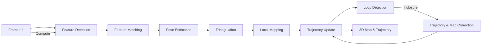

# assets: A Modular VSLAM Python Package


## 🚀 Overview

**assets** is a lightweight, modular Python package designed to implement Visual SLAM (Simultaneous Localization and Mapping) with:

* **Feature Detection & Matching** (SIFT, ORB, BRISK, Affine variants)
* **Pose Estimation & Triangulation**
* **Local Mapping & 3D Trajectory Visualization**
* **Loop Closure Detection** (Bag-of-Visual-Words)
* **Transformations & Normalization** for robustness

This package provides a clear pipeline to go from raw frames to a global 3D map and trajectory.

---

## 📦 Installation

```bash
# Clone the repository
git clone https://github.com/username/vslam-assets.git
cd vslam-assets

# Install dependencies
pip install -r requirements.txt
```

> **Note:** Make sure you have OpenCV, NumPy, scikit-learn, and Plotly installed.

---

## 🗂️ Package Structure

```
assets/              # Python package
├── __init__.py      # Package initializer
├── FrontEnd_Module.py  # Core VSLAM pipeline (Pipeline class)
├── LoopDetection.py    # Bag-of-Visual-Words loop closure (BOVW)
└── Mapping.py          # Local mapping & 3D visualization
```

---

## 📝 Module Descriptions

### 1. `FrontEnd_Module.py`

* **Classes:**

  * `transformations`  – Affine & normalization transforms
  * `featureDetection` – SIFT, ORB, BRISK feature extractors
  * `featureMatching`   – Brute-force matchers with ratio test
  * `CameraMatrices`    – Fundamental/Essential matrix & pose recovery
  * `Pipeline`          – Inherits all above + `LocalMapper` + `BOVW`

* **Key Responsibilities:**

  1. **Detect** keypoints & descriptors in each frame
  2. **Match** against previous frame
  3. **Estimate pose** via Essential Matrix & RANSAC
  4. **Triangulate** 3D points
  5. **Maintain** trajectory & map points
  6. **Loop Closure** correction via BOVW

### 2. `LoopDetection.py`

* **Class:** `BOVW`

  * Loads a pre-trained `KMeans.pkl` vocabulary
  * Builds **Bag-of-Visual-Words** histograms
  * Checks for **loop closures** using cosine similarity + geometric verification

### 3. `Mapping.py`

* **Classes:**

  * `LocalMapper`     – Maintains keyframes & map point structures
  * `MapPoint`, `KeyFrame` – Data containers
  * `Animated3DTrajectory` – Plotly-powered 3D trajectory plots

* **Key Responsibilities:**

  1. **Triangulate** landmarks between keyframes
  2. **Store** keyframes & landmarks
  3. **Visualize** trajectory: static & animated

---

## 🧩 VSLAM Pipeline



1. **Input Frame**: Acquire RGB(D) image.
2. **Feature Detection**: Extract robust keypoints.
3. **Feature Matching**: Match descriptors with previous.
4. **Pose Estimation**: Compute Essential matrix, recover R, t.
5. **Triangulation**: Estimate 3D points.
6. **Local Mapping**: Store keyframes & landmarks.
7. **Loop Closure**: Detect & correct drift.
8. **Output**: Global trajectory & 3D map.

---

## 📖 Theory & Importance

* **Visual SLAM** fuses vision with geometry to localize a camera while mapping the environment.
* **Essential Matrix** constrains relative pose; **RANSAC** ensures robustness to outliers.
* **Triangulation** recovers landmark depths by projecting corresponding points from two views.
* **Loop Closure** reduces drift by re-aligning the current pose to a previously visited location.

> **Why VSLAM?** Enables autonomous navigation (drones, robots), AR/VR tracking, and 3D scene reconstruction.

---

## ✅ Pros & ❌ Cons

| Pros                                              | Cons                                          |
| ------------------------------------------------- | --------------------------------------------- |
| Modular design: easy to extend or replace modules | Scale ambiguity without depth sensors         |
| Multiple feature detectors & matchers             | Sensitive to textureless or repetitive scenes |
| Built-in loop closure                             | Real-time performance depends on hardware     |
| Visualizations with Plotly                        | Requires good calibration & parameter tuning  |

---

## ⚙️ Usage Example

```python
from assets.FrontEnd_Module import Pipeline, KITTIDataset

# Initialize dataset & pipeline
pipe = Pipeline()
K, P = KITTIDataset.load_calib(open('calib.txt'))
pipe.set_k_intrinsic(K)

dataset = KITTIDataset.load_poses(open('poses.txt'), batch_size=100)

for frame in video_frames:
    processed, E, F, trajectory, _ = pipe.VisualOdometry(frame, FeatureDetector='FD_SIFT', FeatureMatcher='FM_BF_NORM_L2')
    display(processed)
```

---

## 📚 References

* OpenCV documentation

---