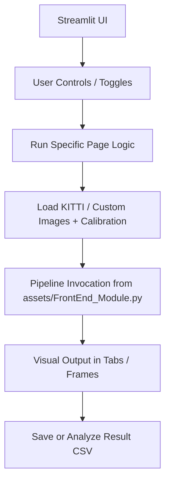

# 📂 Streamlit Pages for Visual SLAM: Interactive VSLAM Suite

A modular, intuitive interface to interactively run and visualize Visual SLAM operations, powered by Streamlit and the `assets` package. This **`pages/`** directory enhances user experience across different modes:

---

## 🔄 Overview of Pages

| Page                  | Purpose                                                                         |
| --------------------- | ------------------------------------------------------------------------------- |
| `Automated_tests.py`  | Bulk testing of sequences with trajectory & pose visualization                  |
| `Simulation.py`       | Full simulation of a sequence with visual word histogram & trajectory animation |
| `Test_SingleImage.py` | Inspect feature detection, descriptor matching, and visual words for two images |
| `viewTestFiles.py`    | Analyze, compare and visualize stored CSV pose results                          |

---

## 🧠 Pipeline Diagram (Interactive Streamlit Frontend)



---

## 🧪 1. `Automated_tests.py`: Batch Visual Odometry

### 🎯 Goal:

Run multiple KITTI sequences with selected feature detectors and matchers, visualize trajectory vs. ground truth, and log pose errors.

### 🔧 Features:

* Toggle between "Run All Sequences" or "Run Single Sequence"
* Choose detectors like **SIFT**, **ORB**, etc.
* Visualize: **Essential Matrix**, **Fundamental Matrix**, **3D Trajectories**, and **BoVW Histograms**
* Save result CSV files
* Compute Mean Squared Error (MSE)

### 📈 Output:

* 3D plots of estimated vs. ground truth trajectory
* Error metrics for every frame
* Downloadable CSV comparisons

---

## 🧪 2. `Simulation.py`: Sequence Simulation + Loop Closure

### 🎯 Goal:

Simulate a KITTI sequence end-to-end and demonstrate loop closure detection using Bag-of-Visual-Words (BoVW).

### 🔧 Features:

* Select sequence & image folder
* Show camera intrinsic & projection matrices
* Real-time VSLAM output: Estimated trajectory & histograms
* Save: **Estimated trajectory** + **visual word histograms** to CSV
* View keyframes and loop closure detections
* Animated 3D Plotly visualization

### 📈 Output:

* Real-time histogram evolution (BoVW)
* Animated 3D trajectory
* Stored simulations available for post-analysis

---

## 🧪 3. `Test_SingleImage.py`: Feature Detector Debugger

### 🎯 Goal:

Test and visualize feature extraction and matching on **two consecutive frames**.

### 🔧 Features:

* Select sequence and image index from folder
* Supports: **Affine SIFT**, **Affine ORB**, **SIFT**, **ORB**, **BRISK**
* View:

  * Keypoints & descriptors for each image
  * Matches between frames (Brute Force)
  * Bag-of-Visual-Words histogram

### 📈 Output:

* Comparative metric panels (Keypoints, Descriptors, Matches)
* Histogram bar charts
* Match visualization (side-by-side)

---

## 📊 4. `viewTestFiles.py`: Pose Result Analyzer

### 🎯 Goal:

Analyze and compare pose prediction accuracy across sequences and feature detectors.

### 🔧 Features:

* Load saved CSV pose outputs
* View:

  * Pose statistics (mean, std, RMSE, trajectory length)
  * Error per meter analysis
  * Best feature detector rankings
* Visualize:

  * Heatmaps across sequences
  * 3D trajectories (predicted vs ground truth)
  * Error distribution line plots

### 📈 Output:

* Performance dashboard
* Interactive visual analytics
* CSV summaries of best feature detectors

---

## 🧬 How All Pages Connect

Each page uses the `Pipeline` class from `assets/FrontEnd_Module.py`, calling:

* `VisualOdometry()` method for frame-by-frame tracking
* `BOVW` class for loop closure
* `Animated3DTrajectory` for visualizations

---

## 📂 Folder Hierarchy

```
pages/
├── Automated_tests.py      # Multi-sequence VO & metrics logger
├── Simulation.py           # Full sequence VSLAM + loop closure
├── Test_SingleImage.py     # Visual inspection of FD + FM
└── viewTestFiles.py        # Statistical analysis dashboard
```

---

## ✅ Summary

These **Streamlit pages** act as frontends to your VSLAM engine:

* 📉 Validate and compare feature detectors
* 🧪 Simulate SLAM sequences with loop detection
* 🔬 Inspect individual matches and histograms
* 📊 Analyze pose accuracy across sequences

Together, they create a **robust, interactive, and insightful framework** for evaluating and debugging Visual SLAM systems.